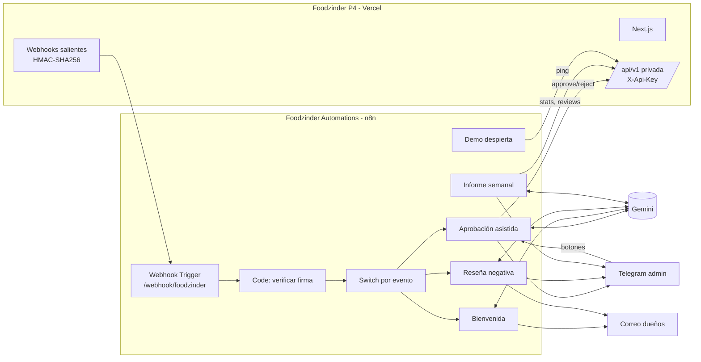

# Arquitectura

## Dónde encaja



Foodzinder no sabe nada de n8n: emite eventos a una URL y expone una API. n8n no toca la base de datos ni Clerk. El contrato entre ambos es [`docs/api.md` del P4](https://github.com/Rolando-Fonseca/sesi-n-10---Directorio-de-restaurantes---pr-ctica/blob/rolando/docs/api.md), escrito antes que cualquiera de los dos lados.

## Principios

1. **Verificar antes de actuar.** Todo evento pasa por el nodo de firma. Sin firma válida, la ejecución termina con error y queda registrada; nada se envía.
2. **Responder rápido, procesar después.** El Webhook Trigger responde `200` de inmediato (Foodzinder reintenta si tarda más de 5 s) y el trabajo sigue en la ejecución.
3. **Idempotencia por `id` de evento.** Cada evento trae un `id`; los flujos que tienen efecto externo (Telegram, correo, API) lo usan como clave para no repetir si Foodzinder reintenta.
4. **La IA propone, la persona decide.** Los resúmenes y borradores llegan a un humano; aprobar o rechazar un restaurante es siempre un clic de una persona.
5. **Código versionado.** Lo que va dentro de un nodo Code se escribe en `src/nodes/`, se testea y se inyecta en los JSON. El editor de n8n no es la fuente de verdad.

## Entrada única

Un solo webhook, `POST /webhook/foodzinder`, recibe todos los eventos. Un nodo Switch enruta por `body.event`. Ventajas: una URL en `WEBHOOK_URLS` de Foodzinder, una verificación de firma, un sitio donde mirar cuando algo falla.

Cabeceras que llegan (contrato del P4):

```
X-Foodzinder-Event: restaurant.created
X-Foodzinder-Delivery: <uuid>
X-Foodzinder-Signature: sha256=<hmac del cuerpo>
```

El Webhook Trigger se configura con **Raw Body** para firmar exactamente los bytes recibidos.

## IA

Gemini por HTTP (nodo HTTP Request al endpoint `generateContent`), sin nodo de LangChain, para que el flujo dependa solo de una clave y de un JSON documentado. Los prompts viven en `src/lib/prompts.mjs` con tests que comprueban que incluyen los datos del evento y las instrucciones de formato (respuesta corta, en español, sin inventar datos). Cada llamada limita `maxOutputTokens` y usa temperatura baja.

Si Gemini falla o tarda más de 20 s, el flujo sigue sin el texto generado: el aviso al administrador llega igual, con los datos crudos. La IA mejora el mensaje, no lo condiciona.

## Canales

- **Telegram** para el administrador: inmediato, gratuito, con botones inline. El flujo 1 usa un Telegram Trigger para recibir el clic y llamar a la API.
- **Correo SMTP** para los dueños: es el canal que un restaurante espera. Gmail con contraseña de aplicación en la demo.

## Persistencia y despliegue

n8n guarda flujos, credenciales y ejecuciones en PostgreSQL. En local, el Postgres del `docker-compose.yml`. En Render (plan gratuito, sin disco), la base de datos está en Neon, en el mismo proyecto que Foodzinder pero en una base distinta. Ver [ADR-0001](adr/0001-n8n-en-docker-y-render-con-neon.md).

## Observabilidad

- Ejecuciones de n8n con entrada y salida de cada nodo.
- Panel de Foodzinder `/dashboard/admin/webhooks`: qué evento se envió, a qué URL, cuántos intentos, qué respondió n8n.
- Cada flujo termina en un nodo que escribe un resumen de una línea en la ejecución (`evento`, `id`, `acción`, `resultado`).
